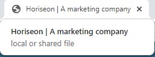

# code-refactor

## Homework 1 - Code refactor

This project helped enhance user accessibility by following accessibility standards. Below we will describe the steps taken to improve quality of source code and the overall improvement of the web application.

You can review the current web application's appearance and functionality by going to the following url: https://santipalacios2002.github.io/code-refactor/ 

<br />

## :heavy_check_mark: Descriptive page title

The title has been modified to be more descriptive

```html
<title>Horiseon | A marketing company</title>
```



<br />

## :heavy_check_mark: HTML Semantics

Some elements have been updated in order to follow the proper HTML semantics


<br />

## :heavy_check_mark: Elements follow a logical structure 

Verified that the all elements follow a logical structure


<br /> 

## :heavy_check_mark: Accesible alt atributes for images

All images have been given an alt attribute to comply with WCAG except background image which is used for aesthetic value and not visual content. 


Solution if prefered: add a title attribute to the proper div to display information for background image (optional)


Post reference: http://christianheilmann.com/2009/02/25/so-how-do-you-add-alternative-text-to-background-images/ 

<br />

## :heavy_check_mark: id attribute added to SEO div 

Added to maintain consistency across all header navigation links


<br />

## :heavy_check_mark: css code consolidation

A few lines of code were consolidated to minimize the amount of lines of code, facilitating the ease of identification of common classes with identical properties.

**Sample of old code:**


**New code:**


Previous css: **200 lines** <br/>
New css: **132 lines**
